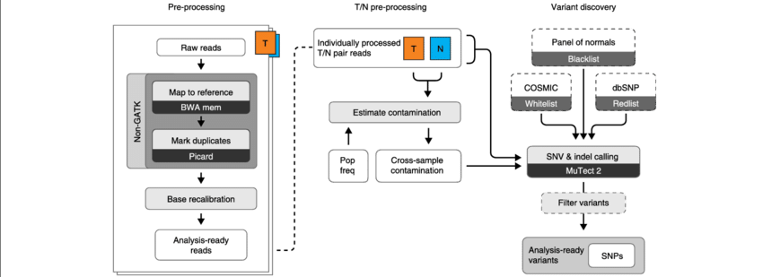

```{r, include = FALSE}
knitr::opts_chunk$set(
  collapse = TRUE,
  comment = "#>"
)
```


## Overview
In this 1-hour workshop, you will have hands-on experience on SNV calling and 
analysis. You will be provided toy short-read sequencing samples, followed by 
read alignments, variant calling and pathogenicity analysis.

### Description
This workshop will guide you through the workflow of a simple genomic SNV analysis.

This is a hands-on workshop, which means you will be given time to get the tools running. 

For each task, you will be given a brief instruction prior to getting your hands dirty. At the end of the given time, there will be a brief summary.

### Pre-requisites

Basic knowledge of using command line and Rstudio is ideal. Although strictly speaking, no prior knowledge is required to attend this workshop.

### Participation

The workshop runs for 2 hours. You will find tasks and related information in the worksheet.

If you run into any problems, please describe the issue and send via zoom chat. The instructors will be monitoring the chat panel and answer any question in real time.

### Tools to be used

* [bwa](http://bio-bwa.sourceforge.net/bwa.shtml)
* [samtools](http://www.htslib.org/doc/samtools.html)
* [Strelka2](https://github.com/Illumina/strelka)
* [COSMIC](https://cancer.sanger.ac.uk/cosmic)
**To be updated**

### Time outline

For this 120-minute workshop:

| Activity                                               | Time |
|--------------------------------------------------------|------|
| Introduction                                           |  5m  |
| Working Environment: command line and Rstudio          | 15m  |
| Read Alignment: bwa and samtools                       | 30m  |
| SNV calling: Strelka2                                  | 40m  |
| Pathogenicity analysis                                 | 20m  |
| Summary                                                | 10m  |

### Workshop goals and objectives

Variant calling is a vital component of genomics studies. Genomic variants have been found in various structures and sizes, including single-nucleotide variants (SNVs), small insertion and deletions (INDELs), copy number variants (CNVs) and structural variants (SVs). Computational tools for detecting these variants are developed with different underlying approaches.

This workshop is designed to offer a hands-on experience on genomic variant calling and analysis. The tasks are designed to guide you through the key steps of SNV analysis on a tumour/normal paired sample.  

### Learning goals

* To understand the general workflow of a genomic variant analysis
* To identify methods to handle short-read sequencing data and variant calls

### Learning objectives

* To recall the key concepts in genomic variant analysis
* To apply the concepts in SNV calling to germline and paired tumour/normal data
* To perform SNV analysis using publicly available resources

## Workshop
### Getting started:
1. Rstudio working environment (console vs. terminal)
2. Data directory
3. Working with UNIX commands
4. SNV analysis workflow (**image to be updated**)

```{r, echo=FALSE}

```

### Task 1: read alignments, sorting, and indexing

Here you will need to align short-read sequencing reads to the reference genome (hg19) and get them ready for SNV calling. There are two samples you will need the work with, the tumor sample and the matched normal sample of COLO829^[Craig, D., Nasser, S., Corbett, R. et al. A somatic reference standard for cancer genome sequencing. Sci Rep 6, 24607 (2016). https://doi.org/10.1038/srep24607].


#### *Aligning reads to the reference genome*

First, we need to map the sequencing reads to the reference genome.
The reads can be found at `/path/to/fastq`, and the reference genome is located at `/path/to/fa`.

```{bash, eval=FALSE, include=TRUE}
bwa mem [options] <idxbase> <in1.fq> [in2.fq] > colo829.sam
```

#### *Converting the output file format*

To be updated
```{bash, eval=FALSE, include=TRUE}
#bwa mem [options] <idxbase> <in1.fq> [in2.fq] > colo829.sam
```

#### *Sorting and indexing*

To be updated
```{bash, eval=FALSE, include=TRUE}
#bwa mem [options] <idxbase> <in1.fq> [in2.fq] > colo829.sam
```


<details>
<summary>Solution (interactively)</summary>
<ul>
<li>First do this.</li>
```{bash, eval = FALSE}
bwa index ref.fa
bwa mem ref.fa read1.fq read2.fq > output.sam
```
<li>Then do that.</li>
```{bash, eval = FALSE}
samtools view -S -b output.sam -o output.bam #converting SAM to BAM
samtools sort output.bam output.sorted #sorting the BAM reads
samtools index output.sorted.bam #indexing the sorted BAM
```

<li>OR, pipe some of the commands in a one-liner:</li>

```{bash, eval = FALSE}
bwa mem ref.fa read1.fq read2.fq | samtools view -S -b - | samtools sort -o output.sorted.bam -

samtools index output.sorted.bam
```

<li>Blah blah.</li>
<li>You should be able to see the resultant files `file1` and `file2`.</li>

</ul>
</details>

### Task 2: calling SNVs using Strelka2
Now that we have the sequencing reads in order, we will start calling SNVs.
Blah blah...

```{bash, eval = FALSE}
#strelka example command
```

### Task 3: investigating the driver gene
Text text

```{r}
#install.packages()

```


